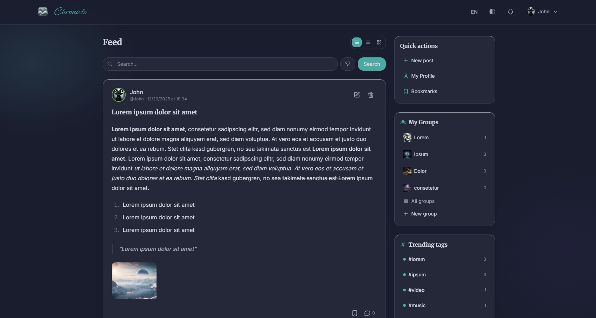
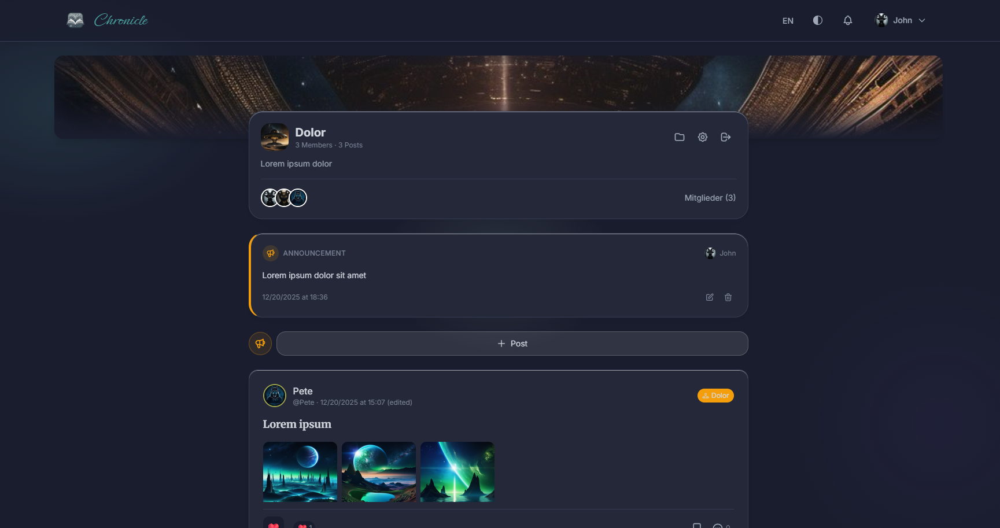
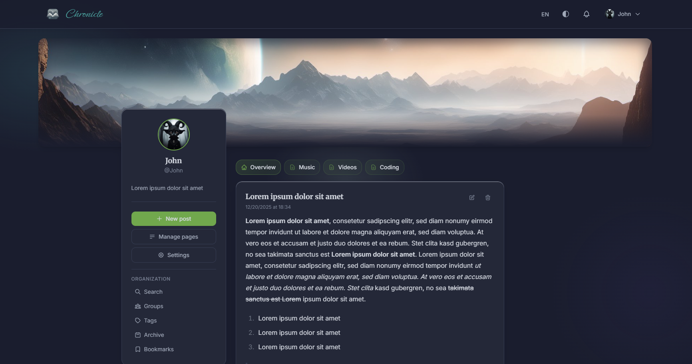

# Chronicle

A modern social blogging platform built with Flask.

## Features

### Blogging
- **Posts** with Markdown support, images and galleries
- **Pages** to organize posts into categories
- **Tags** for flexible content organization
- **Link previews** with embed support (YouTube, Spotify, etc.)
- **Polls** can be integrated into posts
- **Version history** for posts

### Social Features
- **Reactions** with emojis (👍 ❤️ 😂 😮 😢 🎉)
- **Comments** with nested replies
- **@Mentions** to mention other users
- **Bookmarks** for posts
- **Notifications** in real-time

### Groups
- Create and manage private groups
- Group posts and file sharing
- Role-based membership (Admin/Member)

### Users
- Local registration or **Keycloak SSO**
- Profile customization (avatar, cover image, bio)
- Theme colors and layout styles (List, Grid, Masonry, Timeline)

---

## Setup

### Prerequisites
- Docker & Docker Compose

### 1. Clone Repository

```bash
git clone <repository-url>
cd Chronicle
```

### 2. Configure Environment Variables

```bash
cp .env.example .env
```

Adjust important variables in `.env`:

| Variable | Description |
|----------|-------------|
| `SECRET_KEY` | Secret key (change in production!) |
| `FLASK_ENV` | `development` or `production` |
| `REGISTRATION_ENABLED` | `true`/`false` - User registration |
| `ANALYTICS_ADMIN_USERNAME` | Username for Analytics |
| `ANALYTICS_ADMIN_PASSWORD` | Password for Analytics |

### 3. Start

```bash
docker compose up --build
```

This automatically starts:
- **Web App** on port 5000
- **PostgreSQL** database
- **Redis** for caching and sessions

The app is available at **http://localhost:5000**.

### 4. First User

After starting, you can register at `/register` (if `REGISTRATION_ENABLED=true`).

---

## Invite-only registration (recommended for controlled access)

If you do **not** want to expose open self-registration, set:

```env
REGISTRATION_ENABLED=false
```

In this mode, users can only create a local account via an **invitation link**.

### How it works

- **Invite source:** The app reads `invites.txt` from the **project root** on startup.
  - One email address per line
  - Empty lines are ignored
  - Lines starting with `#` are treated as comments
- **Uniqueness:** Each email address receives its **own unique invite token**.
- **6-digit code:** Each invite email contains a **6-digit invitation code** that must be entered during registration.
- **Single-use:** After a successful registration, the invite is marked as used and cannot be used again.
- **Expiry:** Invites expire after **7 days**.
  - If an invite is expired (or not yet sent successfully), a new token + code will be generated and sent on the next startup.
- **Skipping existing users:** If a user with the given email already exists, the email will be skipped.

### Required configuration

Because invites are processed on startup (without an active request context), the application needs a public base URL to build absolute links for emails:

```env
# Example: https://your-domain.tld
PUBLIC_BASE_URL=http://127.0.0.1:5000
```

Additionally, you must configure SMTP settings (see `.env.example`) so the app can send invitation emails.

### Usage

1. Add emails to `invites.txt`:
   ```txt
   alice@example.com
   bob@example.com
   ```
2. Start (or restart) the server.
3. Each new email address will receive an invitation mail containing:
   - a unique registration link: `/auth/register/<token>`
   - a 6-digit invitation code
4. The invited user completes registration on the invite page.

### Invite registration endpoint

- **Invite registration:** `/auth/register/<token>`
- **Standard registration:** `/auth/register` (blocked if `REGISTRATION_ENABLED=false`)

---

## Analytics Dashboard

The Analytics dashboard provides statistics on platform usage.

### Access

1. Navigate to **http://localhost:5000/analytics**
2. Log in with the credentials from `.env`:
   - **Username:** Value of `ANALYTICS_ADMIN_USERNAME` (default: `admin`)
   - **Password:** Value of `ANALYTICS_ADMIN_PASSWORD`

### Available Metrics

- **Users:** Total, active, new registrations
- **Posts:** Total, published, by time period
- **Engagement:** Comments, reactions, bookmarks
- **Groups:** Count, members, activity
- **Top Content:** Most active users, popular tags
- **Activity Charts:** Visualization of platform activity

---

## Keycloak SSO (optional)

For Single Sign-On with Keycloak:

```env
KEYCLOAK_ENABLED=true
KEYCLOAK_SERVER_URL=https://keycloak.example.com
KEYCLOAK_REALM=your-realm
KEYCLOAK_CLIENT_ID=chronicle
KEYCLOAK_CLIENT_SECRET=your-client-secret
```

---

## Internationalization (i18n)

Chronicle supports multiple languages. Currently available:
- 🇩🇪 German (default)
- 🇬🇧 English

### Change Language

Users can change the language via the language switcher in the navigation bar. The preference is saved in the user profile.

### Add New Translations

1. **Extract strings:**
   ```bash
   pybabel extract -F babel.cfg -k _l -o src/translations/messages.pot src/
   ```

2. **Initialize new language** (e.g. French):
   ```bash
   pybabel init -i src/translations/messages.pot -d src/translations -l fr
   ```

3. **Update existing translations:**
   ```bash
   pybabel update -i src/translations/messages.pot -d src/translations
   ```

4. **Compile translations:**
   ```bash
   pybabel compile -d src/translations
   # or
   python scripts/compile_translations.py
   ```

### Translation Files

Translations are located in `src/translations/<lang>/LC_MESSAGES/messages.po`. They must be compiled after editing.

---

## Technology Stack

- **Backend:** Flask, SQLAlchemy, Flask-Login, Flask-Babel
- **Database:** PostgreSQL
- **Cache:** Redis
- **Frontend:** TailwindCSS, Vanilla JS
- **Container:** Docker

---

## Screenshots




